# **目标跟踪算法实现**

代码实现：https://github.com/lovodllt/kalman_track

## **卡尔曼滤波**（KF）

在线性条件下，通过过程与观测两个方面，对输入值进行最优估计

### **原理**

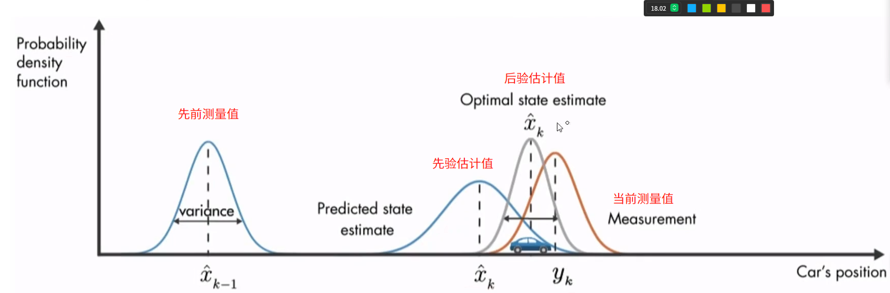

​                                                            （方差模拟不确定性）

### **公式部分：**

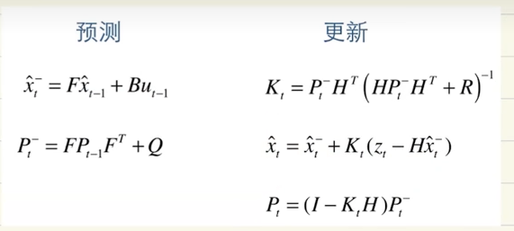

#### **观测（observation）**

$$
\Large
z_t=Hx_t+v_k
$$

各参数含义：
$$
\large
\begin{align*}
&z_t:当前时刻(t)的观测值\\
&H : 观测矩阵H\\
&x_t:当前时刻(t)的真实状态向量\\
&v_k:观测噪声
\end{align*}
$$

#### **预测（Prediction）**

##### 状态预测公式

$$
\Large
\hat{x}_t^{-}=F\hat{x}_{t - 1}+Bu_{t - 1}
$$

根据上一时刻（t - 1）的状态估计值来预测当前时刻（ t ）的状态

推导：

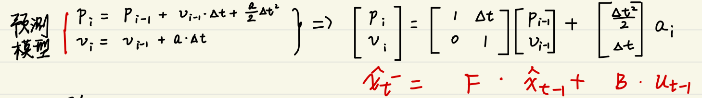

各参数含义：

$$
\large
\begin{align*}
&\hat{x}_t^-:当前时刻(t)的先验姿态估计(预测值)\\
&F:状态转移矩阵 F\\
&\hat{x}_{t-1}:上一时刻(t-1)的后验状态估计(最优估计值)\\
&B:控制矩阵 B\\
&u_{t-1}:上一时刻（t - 1）的控制输入
\end{align*}
$$


##### 协方差预测公式

$$
\Large
P_t^−=FP_{t−1} F^T+Q
$$

衡量变量的总体误差

推导：

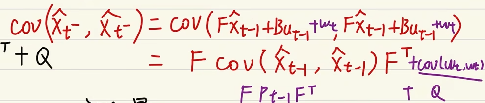

根据上一时刻（t - 1）的状态协方差矩阵来预测当前时刻的状态协方差

各参数含义：
$$
\large
\begin{align*}
&P_t^-:当前时刻(t)的先验估计协方差矩阵(预测值)\\
&F:状态转移矩阵\\
&P_{t-1}:上一时刻(t-1)的后验估计协方差矩阵(最优估计值)\\
&F^T : 状态转移矩阵 F 的转置\\
&Q:过程噪声协方差矩阵
\end{align*}
$$

#### **更新（Update）**

##### 卡尔曼增益公式

$$
\Large
K_t=P_t^−H^T(HP_t^−H^T+R)^{−1}
$$

用于确定在更新状态估计时，测量值所占的比重。

各参数含义：

$$
\large
\begin{align*}
&K_t: 当前时刻(t)的卡尔曼增益(估计值权重)\\
&P_t^−: 当前时刻(t)的先验状态协方差(预测值)\\
&H : 观测矩阵H\\
&R : 测量噪声协方差矩阵R
\end{align*}
$$

##### 状态更新公式

$$
\Large
\hat{x}_t= \hat{x}_t^−+K_t(z_t−H \hat{x}_t^−)
$$

结合预测状态和当前时刻的测量值来得到当前时刻的最优状态估计

各参数含义：
$$
\large
\begin{align*}
&\hat{x}_t: 当前时刻(t)的后验状态估计(最优估计值)\\
&\hat{x}_t^-: 当前时刻(t)的先验状态估计(预测值)\\
&K_t: 当前时刻(t)的卡尔曼增益\\
&z_t: 当前时刻(t)的测量值\\
&H: 观测矩阵H\\
\end{align*}
$$
##### **协方差更新公式**

$$
\Large
P_t=(I−K_tH)P_t^−
$$
根据卡尔曼增益和先验状态协方差来更新当前时刻的状态协方差

各参数含义：
$$
\large
\begin{align*}
&P_t:当前时刻(t)的后验状态协方差(最优值)\\
&I:单位矩阵\\
&K_t: 当前时刻(t)的卡尔曼增益(估计值权重)\\
&H: 观测矩阵\\
&P_t^-:当前时刻(t)的先验状态协方差(预测值)
\end{align*}
$$

### **实例**

需要考虑的状态：

均值：x = [cx, cy, r, h, vx, vy, vr, vh]

--中心坐标（cx, cy）， 高宽比r， 高h， 以及各自的速度变化值

协方差矩阵：由需要控制变量的数量决定，此处为8*8的矩阵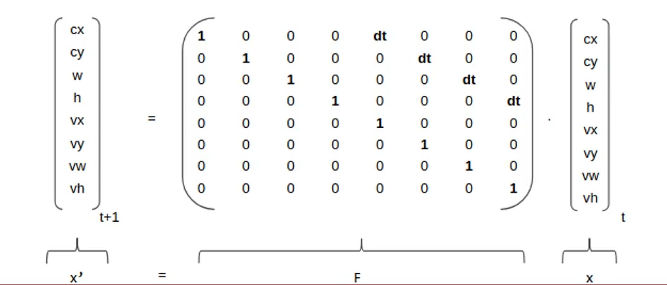

### **代码实现**

```
class KalmanFilter_ {
/* x = [x,
 *      y,
 *      w,
 *      h,
 *      vx,
 *      vy,
 *      vw,
 *      vh]
 */
private:
    Vector8f x;//状态向量
    Matrix8f F;//状态转移矩阵
    Matrix8f P;//误差协方差矩阵
    Matrix8f Q;//过程噪声协方差矩阵
    Eigen::Matrix4f R;//观测噪声协方差矩阵
    Eigen::Matrix<float,8,4> K;//卡尔曼增益
    Eigen::Matrix<float,4,8> H;//观测矩阵
    float dt;
    bool is_init = false;

public:
    KalmanFilter_() : dt(0.01)
    {
        //初始化状态向量
        x << 0, 0, 0, 0, 0, 0, 0, 0;

        //初始化状态转移矩阵
        F = Matrix8f::Identity();

        //初始化过程噪声协方差矩阵
        Q = Matrix8f::Zero(8,8);
        Q.diagonal() << 1e-2, 1e-2, 1e-2, 2e-2, 5e-2, 5e-2, 1e-4, 4e-2;

        //初始化观测噪声协方差矩阵
        R = Eigen::Matrix4f::Identity() * (1e-2);

        //初始化误差协方差
        P = Matrix8f::Identity() * 10;

        //初始化观测矩阵
        H << 1, 0, 0, 0, 0, 0, 0, 0,
             0, 1, 0, 0, 0, 0, 0, 0,
             0, 0, 1, 0, 0, 0, 0, 0,
             0, 0, 0, 1, 0, 0, 0, 0;
    }

    void setF(float dt)
    {
        F << 1, 0, 0, 0, dt, 0,  0,  0,
             0, 1, 0, 0, 0,  dt, 0,  0,
             0, 0, 1, 0, 0,  0,  dt, 0,
             0, 0, 0, 1, 0,  0,  0,  dt,
             0, 0, 0, 0, 1,  0,  0,  0,
             0, 0, 0, 0, 0,  1,  0,  0,
             0, 0, 0, 0, 0,  0,  1,  0,
             0, 0, 0, 0, 0,  0,  0,  1;

        Vector8f new_x = x;
        x[0] = new_x[0] + new_x[4] * dt;
        x[1] = new_x[1] + new_x[5] * dt;
        x[2] = new_x[2] + new_x[6] * dt;
        x[3] = new_x[3] + new_x[7] * dt;
    }

    void init(const Eigen::Vector4f& z)
    {
        x.head<4>() = z;
        is_init = true;
    }

    // 预测
    void predict(float dt)
    {
        if(!is_init) return;

        setF(dt);
        x = F * x;
        P = F * P * F.transpose() + Q;
    }

    // 更新
    void update(const Eigen::Vector4f& z)
    {
        if(!is_init) init(z);

        auto y = z - H * x;
        auto S = H * P * H.transpose() + R;
        K = P * H.transpose() * S.inverse();

        x = x + K * y;
        P = (Matrix8f::Identity() - K * H) * P;
    }

    // 获取当前位置
    Eigen::Vector4f getPosition()
    {
        return x.head<4>();
    }
};typedef Eigen::Matrix<float, 8, 1> Vector8f;
typedef Eigen::Matrix<float, 8, 8> Matrix8f;

class KalmanFilter_ {
/* x = [x,
 *      y,
 *      w,
 *      h,
 *      vx,
 *      vy,
 *      vw,
 *      vh]
 */
private:
    Vector8f x;//状态向量
    Matrix8f F;//状态转移矩阵
    Matrix8f P;//误差协方差矩阵
    Matrix8f Q;//过程噪声协方差矩阵
    Eigen::Matrix4f R;//观测噪声协方差矩阵
    Eigen::Matrix<float,8,4> K;//卡尔曼增益
    Eigen::Matrix<float,4,8> H;//观测矩阵
    float dt;
    bool is_init = false;

public:
    KalmanFilter_() : dt(0.01)
    {
        //初始化状态向量
        x << 0, 0, 0, 0, 0, 0, 0, 0;

        //初始化状态转移矩阵
        F = Matrix8f::Identity();

        //初始化过程噪声协方差矩阵
        Q = Matrix8f::Zero(8,8);
        Q.diagonal() << 1.0, 1.0, 1.0, 1.0, 2.0, 2.0, 2.0, 2.0;

        //初始化观测噪声协方差矩阵
        R = Eigen::Matrix4f::Identity() * 0.01;

        //初始化误差协方差
        P = Matrix8f::Identity() * 10;

        //初始化观测矩阵
        H << 1, 0, 0, 0, 0, 0, 0, 0,
             0, 1, 0, 0, 0, 0, 0, 0,
             0, 0, 1, 0, 0, 0, 0, 0,
             0, 0, 0, 1, 0, 0, 0, 0;
    }

    void setF(float dt)
    {
        F << 1, 0, 0, 0, dt, 0,  0,  0,
             0, 1, 0, 0, 0,  dt, 0,  0,
             0, 0, 1, 0, 0,  0,  dt, 0,
             0, 0, 0, 1, 0,  0,  0,  dt,
             0, 0, 0, 0, 1,  0,  0,  0,
             0, 0, 0, 0, 0,  1,  0,  0,
             0, 0, 0, 0, 0,  0,  1,  0,
             0, 0, 0, 0, 0,  0,  0,  1;
    }

    void init(const Eigen::Vector4f& z)
    {
        x.head<4>() = z;
        is_init = true;
    }

    // 预测
    void predict(float dt)
    {
        if(!is_init) return;

        setF(dt);
        x = F * x;
        P = F * P * F.transpose() + Q;
    }

    // 更新
    void update(const Eigen::Vector4f& z)
    {
        if(!is_init) init(z);

        auto y = z - H * x;
        auto S = H * P * H.transpose() + R;
        K = P * H.transpose() * S.inverse();

        x = x + K * y;
        P = (Matrix8f::Identity() - K * H) * P;
    }

    // 获取当前位置
    Eigen::Vector4f getPosition()
    {
        return x.head<4>();
    }
};
```

## 扩展卡尔曼滤波（EKF）

可应用于非线性环境。相较于卡尔曼滤波，状态向量中可以引入加速度，旋转等非线性内容

通过对状态转移矩阵和观测矩阵进行求导降阶，实现对非线性函数进行线性化近拟

### **公式部分**

#### **观测（Observation）**

$$
\Large
z_t=H(x_t)+Q
$$

各参数含义：
$$
\large
\begin{align*}
&z_t:当前时刻(t)的观测值\\
&H(-):观测函数，非线性函数\\
&x_t: 当前时刻(t)的真实状态向量\\
&Q: 观测噪声
\end{align*}
$$

#### **预测（Prediction）**

##### 状态预测公式

$$
\Large
\hat{x}_t^-=f(\hat{x}_{t−1},u_t)
$$

各参数含义：
$$
\large
\begin{align*}
&\hat{x}_t^-:当前时刻(t)的先验姿态估计(预测值)\\
&f(-):非线性函数，描述了系统状态如何从t-1时刻转移到t时刻\\
&\hat{x}_t:上一时刻(t-1)的后验状态估计(最优估计值)
\end{align*}
$$

##### 协方差预测公式

$$
\Large
P_t^-=F_tP_{t-1}F_t^T+Q
$$

各参数含义：
$$
\large
\begin{align*}
&P_t^-:当前时刻(t)的先验估计协方差矩阵\\
&F_t:状态转移矩阵在\hat{x}_t^-处的雅可比矩阵\\
&P_{t-1}:上一时刻(t-1)的后验估计协方差矩阵\\
&Q:过程噪声协方差矩阵
\end{align*}
$$

#### **更新（Update）**

##### 卡尔曼增益公式

$$
\Large
K_t=P_t^−H_t^T(H_tP_t^−H_t^T+R)^{−1}
$$

各参数含义：
$$
\large
\begin{align*}
&K_t: 当前时刻(t)的卡尔曼增益(估计值权重)\\
&P_t^−: 当前时刻(t)的先验状态协方差(预测值)\\
&H_t: 观测函数H在\hat{x}_{t}^{-}处的雅克比矩阵\\
&R : 测量噪声协方差矩阵R
\end{align*}
$$

##### 状态更新公式

$$
\Large
\hat{x}_t= \hat{x}_t^−+K_t(z_t−H(\hat{x}_t^−))
$$

各参数含义：
$$
\large
\begin{align*}
&\hat{x}_t: 当前时刻(t)的后验状态估计(最优估计值)\\
&\hat{x}_t^-: 当前时刻(t)的先验状态估计(预测值)\\
&K_t: 当前时刻(t)的卡尔曼增益\\
&z_t: 当前时刻(t)的测量值\\
&H: 观测矩阵H(x)在t时刻先验状态估计值\hat{x}_t^-处的计算结果\\
\end{align*}
$$

##### 协方差更新公式

$$
\Large
P_t=(I−K_tH_t)P_t^−
$$

各参数含义：
$$
\large
\begin{align*}
&P_t:当前时刻(t)的后验状态协方差(最优值)\\
&I:单位矩阵\\
&K_t: 当前时刻(t)的卡尔曼增益(估计值权重)\\
&H_t: 观测函数H在\hat{x}_{t}^{-}处的雅克比矩阵\\
&P_t^-:当前时刻(t)的先验状态协方差(预测值)
\end{align*}
$$

## **匈牙利算法**

### **最小匹配**

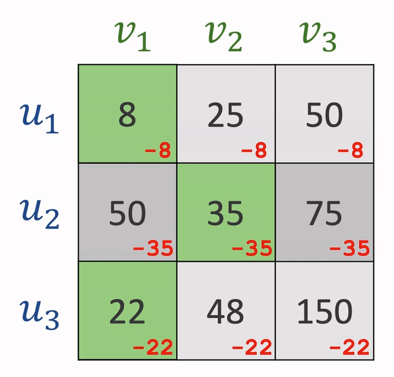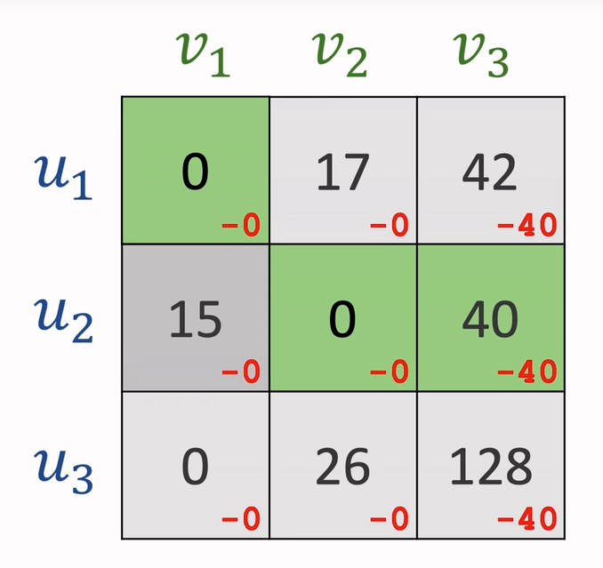

对于n*n的矩阵，先执行以下步骤：

1. 每一行减去该行最小值
2. 每一列减去该列最小值

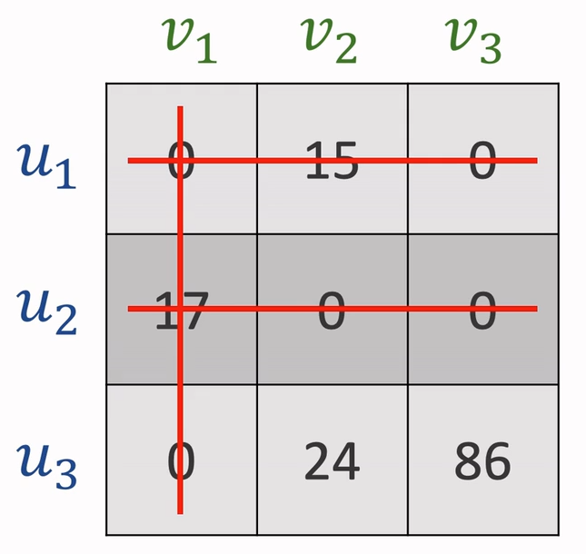

接着进入循环

1. 用最少的直线覆盖住所有0
2. 若直线数=n，退出循环；若直线数<n，进行下一步
3. 找出未被覆盖的数中的最小值设定为k，使所有未被覆盖的值减去k，已被覆盖的非0值加上k

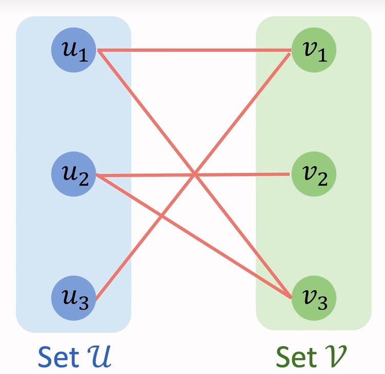

接下来分配即可

### **最大匹配**

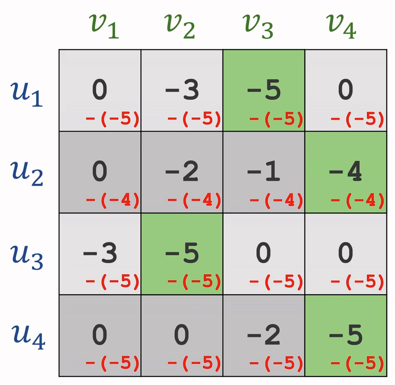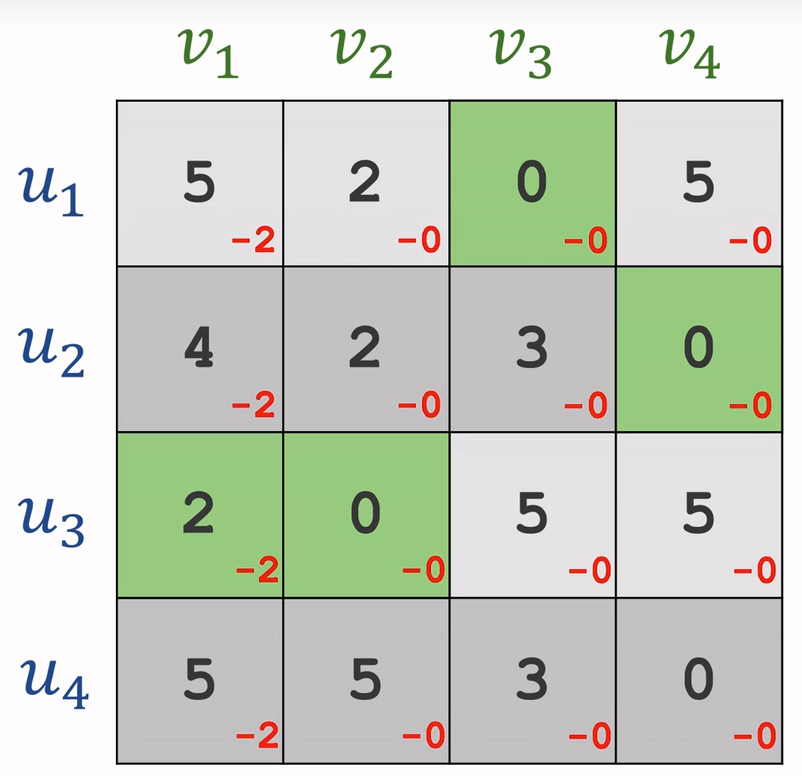

先对所有值取反，再进行最小匹配即可

```
class HungarianAlgorithm{
public:
    Eigen::VectorXi solve(const MatrixXb& cost_matrix)
    {
        int n = cost_matrix.rows(); //代价矩阵的行数（跟踪器数量）
        int m = cost_matrix.cols(); //代价矩阵的列数（检测框数量）
        Eigen::VectorXi assignment = Eigen::VectorXi::Constant(n,-1); //存储每个跟踪器的匹配结果
        Eigen::VectorXi visited = Eigen::VectorXi::Zero(m); //列访问标记

        //匹配跟踪器和检测框
        for(int i = 0;i < n;i++)
        {
            visited.setZero();
            dfs(i, cost_matrix, assignment, visited);
        }

        return assignment;
    }
private:
    /*逻辑：
     * 1. 遍历每个跟踪器，对每个跟踪器，遍历每个检测框
     * 2. 如果cost_matrix[i,j]为true，且检测框j未被访问过，则直接占用该匹配
     * 3. 如果检测框j已被匹配，则递归调用dfs函数，尝试寻找其他匹配
     * 4. 如果找到匹配，则返回true，否则返回false
     */
    //深度优先搜索匹配跟踪器和检测框
    bool dfs(int i, const MatrixXb& cost_matrix, Eigen::VectorXi& assignment, Eigen::VectorXi& visited)
    {
        for(int j = 0;j < cost_matrix.cols();j++)
        {
            if(cost_matrix(i,j) && !visited(j))
            {
                visited(j) = 1;
                if(assignment(j) == -1 || dfs(assignment(j), cost_matrix, assignment, visited))
                {
                    assignment(j) = i;
                    return true;
                }
            }
        }
        return false;
    }
};
```

### **KM算法**

匈牙利算法的扩展，可以量化匹配代价（iou，外观相似度等）。引入了顶标机制（u，v），松弛操作（delta）和增广路径回溯（way）

#### **增广路径**

对于二分图的最大匹配，从每一个点开始，都进行一次增广路径查找

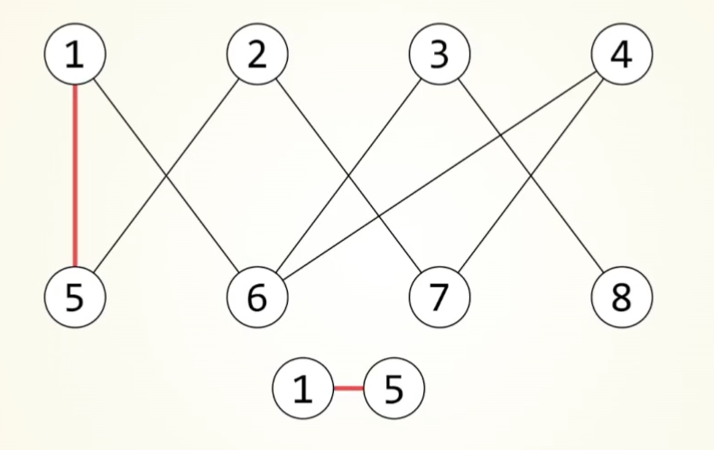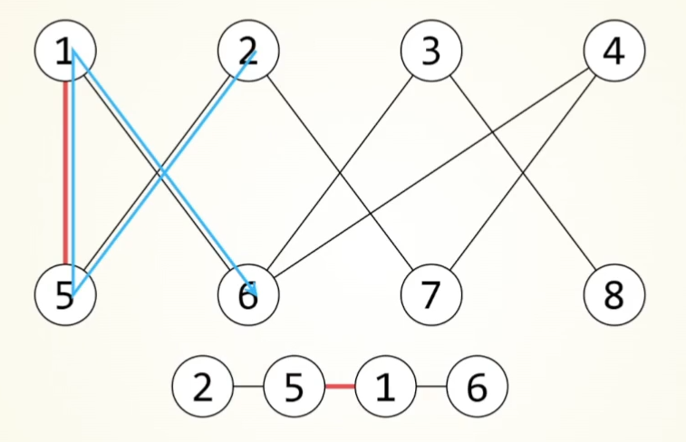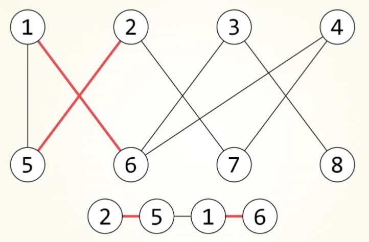

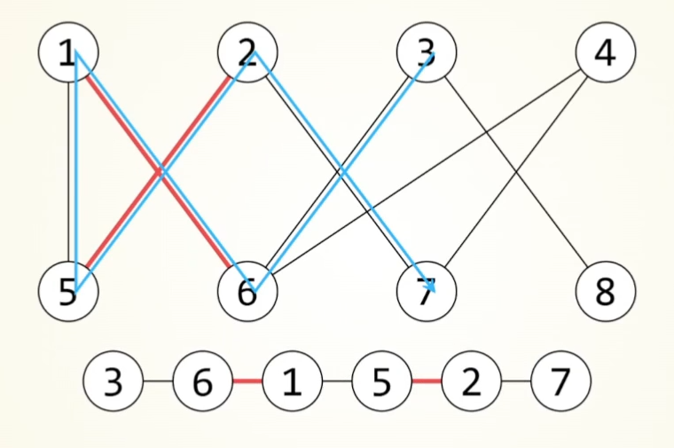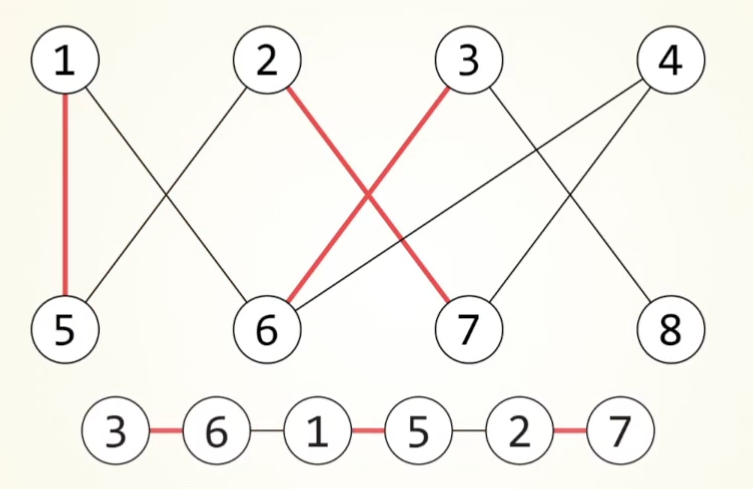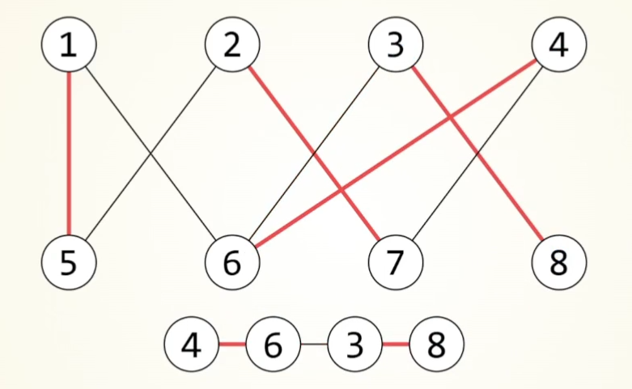

## deepsort算法

### **流程**

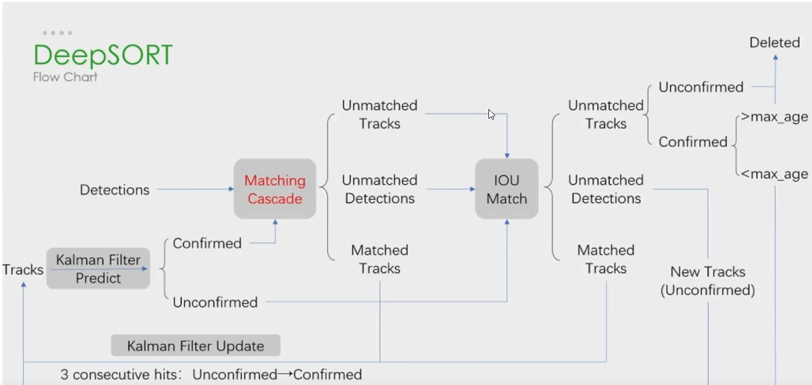

大致流程：

Detection为预测到的框，Tracks为本次检测到的物体。

当检测到一个物体，对其直接进行iou匹配，如果没有对应的detection，初始化一个新的Track。

不确定状态：如若该目标连续匹配到3帧，其状态由不确定改为确定。该状态出现匹配丢失则直接舍弃。

确定状态：先进行级联匹配，对于指定帧数内，按照丢失次数多少排优先级，按优先级和对应的Detection进行匹配，未匹配上的进入iou匹配，对于丢失的物体，连续丢失超过阈值才进行舍弃。

（每次匹配成功都要更新卡尔曼参数，只有确认状态才会进行可视化）

### **级联匹配**

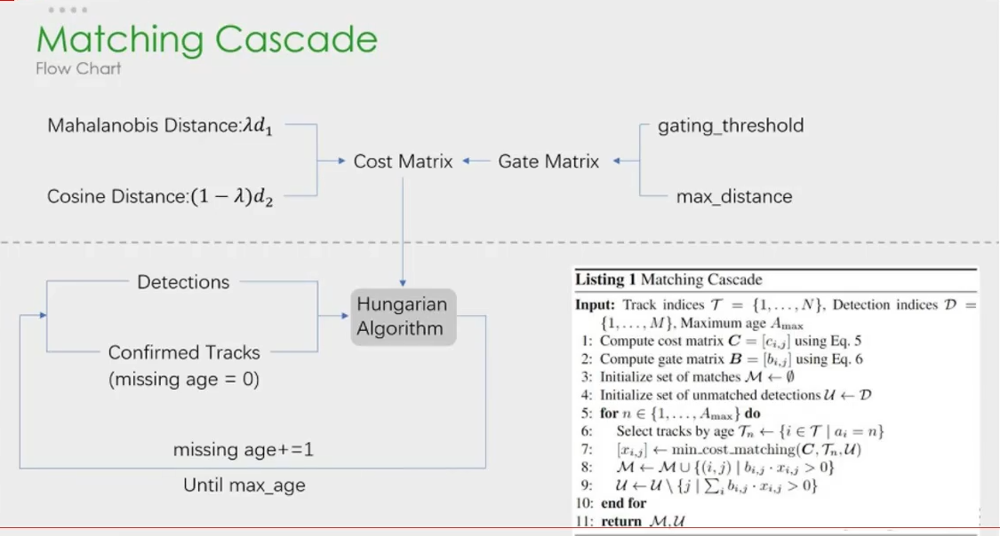

按照丢失的帧率，由少到多排序进行匹配